# DECNET Codebase AST Graph

This diagram shows the structural organization of the DECNET project, extracted directly from the Python Abstract Syntax Tree (AST). It includes modules (prefixed with `Module_`), their internal functions, and the classes and methods they contain.

```mermaid
classDiagram
    class Module_distros {
        +random_hostname()
        +get_distro()
        +random_distro()
        +all_distros()
    }
    class distros_DistroProfile {
    }
    Module_distros ..> distros_DistroProfile : contains

    class custom_service_CustomService {
        +__init__()
        +compose_fragment()
        +dockerfile_context()
    }
    Module_custom_service ..> custom_service_CustomService : contains
    class Module_os_fingerprint {
        +get_os_sysctls()
        +all_os_families()
    }

    class Module_network {
        +_run()
        +detect_interface()
        +detect_subnet()
        +get_host_ip()
        +allocate_ips()
        +create_macvlan_network()
        +create_ipvlan_network()
        +remove_macvlan_network()
        +_require_root()
        +setup_host_macvlan()
        +teardown_host_macvlan()
        +setup_host_ipvlan()
        +teardown_host_ipvlan()
        +ips_to_range()
    }

    class Module_env {
        +_port()
        +_require_env()
    }

    class Module_config {
        +random_hostname()
        +save_state()
        +load_state()
        +clear_state()
    }
    class config_DeckyConfig {
        +services_not_empty()
    }
    Module_config ..> config_DeckyConfig : contains
    class config_DecnetConfig {
    }
    Module_config ..> config_DecnetConfig : contains
    class Module_ini_loader {
        +load_ini()
        +load_ini_from_string()
        +validate_ini_string()
        +_parse_configparser()
    }
    class ini_loader_DeckySpec {
    }
    Module_ini_loader ..> ini_loader_DeckySpec : contains
    class ini_loader_CustomServiceSpec {
    }
    Module_ini_loader ..> ini_loader_CustomServiceSpec : contains
    class ini_loader_IniConfig {
    }
    Module_ini_loader ..> ini_loader_IniConfig : contains
    class Module_composer {
        +generate_compose()
        +write_compose()
    }

    class Module_archetypes {
        +get_archetype()
        +all_archetypes()
        +random_archetype()
    }
    class archetypes_Archetype {
    }
    Module_archetypes ..> archetypes_Archetype : contains
    class Module_fleet {
        +all_service_names()
        +resolve_distros()
        +build_deckies()
        +build_deckies_from_ini()
    }

    class Module_cli {
        +_kill_api()
        +api()
        +deploy()
        +collect()
        +mutate()
        +status()
        +teardown()
        +list_services()
        +list_distros()
        +correlate()
        +list_archetypes()
        +serve_web()
    }


    class services_base_BaseService {
        +compose_fragment()
        +dockerfile_context()
    }
    Module_services_base ..> services_base_BaseService : contains

    class services_http_HTTPService {
        +compose_fragment()
        +dockerfile_context()
    }
    Module_services_http ..> services_http_HTTPService : contains

    class services_smtp_SMTPService {
        +compose_fragment()
        +dockerfile_context()
    }
    Module_services_smtp ..> services_smtp_SMTPService : contains

    class services_mysql_MySQLService {
        +compose_fragment()
        +dockerfile_context()
    }
    Module_services_mysql ..> services_mysql_MySQLService : contains

    class services_redis_RedisService {
        +compose_fragment()
        +dockerfile_context()
    }
    Module_services_redis ..> services_redis_RedisService : contains

    class services_elasticsearch_ElasticsearchService {
        +compose_fragment()
        +dockerfile_context()
    }
    Module_services_elasticsearch ..> services_elasticsearch_ElasticsearchService : contains

    class services_ftp_FTPService {
        +compose_fragment()
        +dockerfile_context()
    }
    Module_services_ftp ..> services_ftp_FTPService : contains

    class services_imap_IMAPService {
        +compose_fragment()
        +dockerfile_context()
    }
    Module_services_imap ..> services_imap_IMAPService : contains

    class services_k8s_KubernetesAPIService {
        +compose_fragment()
        +dockerfile_context()
    }
    Module_services_k8s ..> services_k8s_KubernetesAPIService : contains

    class services_ldap_LDAPService {
        +compose_fragment()
        +dockerfile_context()
    }
    Module_services_ldap ..> services_ldap_LDAPService : contains

    class services_llmnr_LLMNRService {
        +compose_fragment()
        +dockerfile_context()
    }
    Module_services_llmnr ..> services_llmnr_LLMNRService : contains

    class services_mongodb_MongoDBService {
        +compose_fragment()
        +dockerfile_context()
    }
    Module_services_mongodb ..> services_mongodb_MongoDBService : contains

    class services_mqtt_MQTTService {
        +compose_fragment()
        +dockerfile_context()
    }
    Module_services_mqtt ..> services_mqtt_MQTTService : contains

    class services_mssql_MSSQLService {
        +compose_fragment()
        +dockerfile_context()
    }
    Module_services_mssql ..> services_mssql_MSSQLService : contains

    class services_pop3_POP3Service {
        +compose_fragment()
        +dockerfile_context()
    }
    Module_services_pop3 ..> services_pop3_POP3Service : contains

    class services_postgres_PostgresService {
        +compose_fragment()
        +dockerfile_context()
    }
    Module_services_postgres ..> services_postgres_PostgresService : contains

    class services_rdp_RDPService {
        +compose_fragment()
        +dockerfile_context()
    }
    Module_services_rdp ..> services_rdp_RDPService : contains

    class services_sip_SIPService {
        +compose_fragment()
        +dockerfile_context()
    }
    Module_services_sip ..> services_sip_SIPService : contains

    class services_smb_SMBService {
        +compose_fragment()
        +dockerfile_context()
    }
    Module_services_smb ..> services_smb_SMBService : contains

    class services_snmp_SNMPService {
        +compose_fragment()
        +dockerfile_context()
    }
    Module_services_snmp ..> services_snmp_SNMPService : contains

    class services_tftp_TFTPService {
        +compose_fragment()
        +dockerfile_context()
    }
    Module_services_tftp ..> services_tftp_TFTPService : contains

    class services_vnc_VNCService {
        +compose_fragment()
        +dockerfile_context()
    }
    Module_services_vnc ..> services_vnc_VNCService : contains

    class services_docker_api_DockerAPIService {
        +compose_fragment()
        +dockerfile_context()
    }
    Module_services_docker_api ..> services_docker_api_DockerAPIService : contains
    class Module_services_registry {
        +_load_plugins()
        +register_custom_service()
        +get_service()
        +all_services()
    }


    class services_smtp_relay_SMTPRelayService {
        +compose_fragment()
        +dockerfile_context()
    }
    Module_services_smtp_relay ..> services_smtp_relay_SMTPRelayService : contains

    class services_conpot_ConpotService {
        +compose_fragment()
        +dockerfile_context()
    }
    Module_services_conpot ..> services_conpot_ConpotService : contains

    class services_ssh_SSHService {
        +compose_fragment()
        +dockerfile_context()
    }
    Module_services_ssh ..> services_ssh_SSHService : contains

    class services_telnet_TelnetService {
        +compose_fragment()
        +dockerfile_context()
    }
    Module_services_telnet ..> services_telnet_TelnetService : contains
    class Module_logging_forwarder {
        +parse_log_target()
        +probe_log_target()
    }

    class Module_logging_file_handler {
        +_get_logger()
        +write_syslog()
        +get_log_path()
    }

    class Module_logging_syslog_formatter {
        +_pri()
        +_truncate()
        +_sd_escape()
        +_sd_element()
        +format_rfc5424()
    }


    class correlation_graph_TraversalHop {
    }
    Module_correlation_graph ..> correlation_graph_TraversalHop : contains
    class correlation_graph_AttackerTraversal {
        +first_seen()
        +last_seen()
        +duration_seconds()
        +deckies()
        +decky_count()
        +path()
        +to_dict()
    }
    Module_correlation_graph ..> correlation_graph_AttackerTraversal : contains
    class Module_correlation_engine {
        +_fmt_duration()
    }
    class correlation_engine_CorrelationEngine {
        +__init__()
        +ingest()
        +ingest_file()
        +traversals()
        +all_attackers()
        +report_table()
        +report_json()
        +traversal_syslog_lines()
    }
    Module_correlation_engine ..> correlation_engine_CorrelationEngine : contains
    class Module_correlation_parser {
        +_parse_sd_params()
        +_extract_attacker_ip()
        +parse_line()
    }
    class correlation_parser_LogEvent {
    }
    Module_correlation_parser ..> correlation_parser_LogEvent : contains
    class Module_web_auth {
        +verify_password()
        +get_password_hash()
        +create_access_token()
    }

    class Module_engine_deployer {
        +_sync_logging_helper()
        +_compose()
        +_compose_with_retry()
        +deploy()
        +teardown()
        +status()
        +_print_status()
    }

    class Module_collector_worker {
        +parse_rfc5424()
        +_load_service_container_names()
        +is_service_container()
        +is_service_event()
        +_stream_container()
    }

    class Module_mutator_engine {
        +mutate_decky()
        +mutate_all()
        +run_watch_loop()
    }


    class web_db_repository_BaseRepository {
    }
    Module_web_db_repository ..> web_db_repository_BaseRepository : contains

    class web_db_models_User {
    }
    Module_web_db_models ..> web_db_models_User : contains
    class web_db_models_Log {
    }
    Module_web_db_models ..> web_db_models_Log : contains
    class web_db_models_Bounty {
    }
    Module_web_db_models ..> web_db_models_Bounty : contains
    class web_db_models_Token {
    }
    Module_web_db_models ..> web_db_models_Token : contains
    class web_db_models_LoginRequest {
    }
    Module_web_db_models ..> web_db_models_LoginRequest : contains
    class web_db_models_ChangePasswordRequest {
    }
    Module_web_db_models ..> web_db_models_ChangePasswordRequest : contains
    class web_db_models_LogsResponse {
    }
    Module_web_db_models ..> web_db_models_LogsResponse : contains
    class web_db_models_BountyResponse {
    }
    Module_web_db_models ..> web_db_models_BountyResponse : contains
    class web_db_models_StatsResponse {
    }
    Module_web_db_models ..> web_db_models_StatsResponse : contains
    class web_db_models_MutateIntervalRequest {
    }
    Module_web_db_models ..> web_db_models_MutateIntervalRequest : contains
    class web_db_models_DeployIniRequest {
    }
    Module_web_db_models ..> web_db_models_DeployIniRequest : contains
    class Module_web_db_sqlite_database {
        +get_async_engine()
        +get_sync_engine()
        +init_db()
    }


    class web_db_sqlite_repository_SQLiteRepository {
        +__init__()
        +_initialize_sync()
        +_apply_filters()
        +_apply_bounty_filters()
    }
    Module_web_db_sqlite_repository ..> web_db_sqlite_repository_SQLiteRepository : contains
```

