# DECNET: Complete Execution Graph

This diagram represents the absolute complete call graph of the DECNET project. It connects initial entry points (CLI and Web API) through the orchestration layers, down to the low-level network and service container logic.

```mermaid
graph TD
    subgraph CLI_Entry
        cli__kill_api([_kill_api])
        cli_api([api])
        cli_deploy([deploy])
        cli_collect([collect])
        cli_mutate([mutate])
        cli_status([status])
        cli_teardown([teardown])
        cli_list_services([list_services])
        cli_list_distros([list_distros])
        cli_correlate([correlate])
        cli_list_archetypes([list_archetypes])
        cli_serve_web([serve_web])
        cli_do_GET([do_GET])
    end
    subgraph Fleet_Management
        distros_random_hostname([distros_random_hostname])
        distros_get_distro([distros_get_distro])
        distros_random_distro([distros_random_distro])
        distros_all_distros([distros_all_distros])
        ini_loader_load_ini([ini_loader_load_ini])
        ini_loader_load_ini_from_string([ini_loader_load_ini_from_string])
        ini_loader_validate_ini_string([ini_loader_validate_ini_string])
        ini_loader__parse_configparser([ini_loader__parse_configparser])
        archetypes_get_archetype([archetypes_get_archetype])
        archetypes_all_archetypes([archetypes_all_archetypes])
        archetypes_random_archetype([archetypes_random_archetype])
        fleet_all_service_names([all_service_names])
        fleet_resolve_distros([resolve_distros])
        fleet_build_deckies([build_deckies])
        fleet_build_deckies_from_ini([build_deckies_from_ini])
    end
    subgraph Deployment_Engine
        network__run([network__run])
        network_detect_interface([network_detect_interface])
        network_detect_subnet([network_detect_subnet])
        network_get_host_ip([network_get_host_ip])
        network_allocate_ips([network_allocate_ips])
        network_create_macvlan_network([network_create_macvlan_network])
        network_create_ipvlan_network([network_create_ipvlan_network])
        network_remove_macvlan_network([network_remove_macvlan_network])
        network__require_root([network__require_root])
        network_setup_host_macvlan([network_setup_host_macvlan])
        network_teardown_host_macvlan([network_teardown_host_macvlan])
        network_setup_host_ipvlan([network_setup_host_ipvlan])
        network_teardown_host_ipvlan([network_teardown_host_ipvlan])
        network_ips_to_range([network_ips_to_range])
        config_random_hostname([config_random_hostname])
        config_save_state([config_save_state])
        config_load_state([config_load_state])
        config_clear_state([config_clear_state])
        composer_generate_compose([composer_generate_compose])
        composer_write_compose([composer_write_compose])
        engine_deployer__sync_logging_helper([_sync_logging_helper])
        engine_deployer__compose([_compose])
        engine_deployer__compose_with_retry([_compose_with_retry])
        engine_deployer_deploy([deploy])
        engine_deployer_teardown([teardown])
        engine_deployer_status([status])
        engine_deployer__print_status([_print_status])
    end
    subgraph Monitoring_Mutation
        collector_worker_parse_rfc5424([parse_rfc5424])
        collector_worker__load_service_container_names([_load_service_container_names])
        collector_worker_is_service_container([is_service_container])
        collector_worker_is_service_event([is_service_event])
        collector_worker__stream_container([_stream_container])
        collector_worker_log_collector_worker([log_collector_worker])
        collector_worker__spawn([_spawn])
        collector_worker__watch_events([_watch_events])
        mutator_engine_mutate_decky([mutate_decky])
        mutator_engine_mutate_all([mutate_all])
        mutator_engine_run_watch_loop([run_watch_loop])
    end
    subgraph Web_Service
        web_auth_verify_password([web_auth_verify_password])
        web_auth_get_password_hash([web_auth_get_password_hash])
        web_auth_create_access_token([web_auth_create_access_token])
        web_db_repository_initialize([web_db_repository_initialize])
        web_db_repository_add_log([web_db_repository_add_log])
        web_db_repository_get_logs([web_db_repository_get_logs])
        web_db_repository_get_total_logs([web_db_repository_get_total_logs])
        web_db_repository_get_stats_summary([web_db_repository_get_stats_summary])
        web_db_repository_get_deckies([web_db_repository_get_deckies])
        web_db_repository_get_user_by_uuid([web_db_repository_get_user_by_uuid])
        web_db_repository_update_user_password([web_db_repository_update_user_password])
        web_db_repository_add_bounty([web_db_repository_add_bounty])
        web_db_repository_get_bounties([web_db_repository_get_bounties])
        web_db_repository_get_total_bounties([web_db_repository_get_total_bounties])
        web_db_sqlite_database_get_async_engine([web_db_sqlite_database_get_async_engine])
        web_db_sqlite_database_get_sync_engine([web_db_sqlite_database_get_sync_engine])
        web_db_sqlite_database_init_db([web_db_sqlite_database_init_db])
        web_db_sqlite_repository_initialize([web_db_sqlite_repository_initialize])
        web_db_sqlite_repository_reinitialize([web_db_sqlite_repository_reinitialize])
        web_db_sqlite_repository_add_log([web_db_sqlite_repository_add_log])
        web_db_sqlite_repository__apply_filters([web_db_sqlite_repository__apply_filters])
        web_db_sqlite_repository_get_logs([web_db_sqlite_repository_get_logs])
        web_db_sqlite_repository_get_max_log_id([web_db_sqlite_repository_get_max_log_id])
        web_db_sqlite_repository_get_logs_after_id([web_db_sqlite_repository_get_logs_after_id])
        web_db_sqlite_repository_get_total_logs([web_db_sqlite_repository_get_total_logs])
        web_db_sqlite_repository_get_log_histogram([web_db_sqlite_repository_get_log_histogram])
        web_db_sqlite_repository_get_stats_summary([web_db_sqlite_repository_get_stats_summary])
        web_db_sqlite_repository_get_deckies([web_db_sqlite_repository_get_deckies])
        web_db_sqlite_repository_get_user_by_username([web_db_sqlite_repository_get_user_by_username])
        web_db_sqlite_repository_get_user_by_uuid([web_db_sqlite_repository_get_user_by_uuid])
        web_db_sqlite_repository_create_user([web_db_sqlite_repository_create_user])
        web_db_sqlite_repository_update_user_password([web_db_sqlite_repository_update_user_password])
        web_db_sqlite_repository_add_bounty([web_db_sqlite_repository_add_bounty])
        web_db_sqlite_repository__apply_bounty_filters([web_db_sqlite_repository__apply_bounty_filters])
        web_db_sqlite_repository_get_bounties([web_db_sqlite_repository_get_bounties])
        web_db_sqlite_repository_get_total_bounties([web_db_sqlite_repository_get_total_bounties])
        web_router_auth_api_change_pass_change_password([auth_api_change_pass_change_password])
        web_router_auth_api_login_login([auth_api_login_login])
        web_router_logs_api_get_logs_get_logs([logs_api_get_logs_get_logs])
        web_router_logs_api_get_histogram_get_logs_histogram([logs_api_get_histogram_get_logs_histogram])
        web_router_bounty_api_get_bounties_get_bounties([bounty_api_get_bounties_get_bounties])
        web_router_stats_api_get_stats_get_stats([stats_api_get_stats_get_stats])
        web_router_fleet_api_mutate_decky_api_mutate_decky([api_mutate_decky_api_mutate_decky])
        web_router_fleet_api_get_deckies_get_deckies([api_get_deckies_get_deckies])
        web_router_fleet_api_mutate_interval_api_update_mutate_interval([api_mutate_interval_api_update_mutate_interval])
        web_router_fleet_api_deploy_deckies_api_deploy_deckies([api_deploy_deckies_api_deploy_deckies])
        web_router_stream_api_stream_events_stream_events([stream_api_stream_events_stream_events])
        web_router_stream_api_stream_events_event_generator([stream_api_stream_events_event_generator])
    end

    %% Key Connection Edges
    network_detect_interface --> network__run
    network_detect_subnet --> network__run
    network_get_host_ip --> network__run
    network_setup_host_macvlan --> network__run
    network_teardown_host_macvlan --> network__run
    network_setup_host_ipvlan --> network__run
    network_teardown_host_ipvlan --> network__run
    
    ini_loader_load_ini --> ini_loader__parse_configparser
    ini_loader_load_ini_from_string --> ini_loader__parse_configparser
    
    composer_generate_compose --> os_fingerprint_get_os_sysctls
    composer_write_compose --> composer_generate_compose
    
    fleet_resolve_distros --> distros_random_distro
    fleet_build_deckies --> fleet_resolve_distros
    fleet_build_deckies --> config_random_hostname
    fleet_build_deckies_from_ini --> archetypes_get_archetype
    fleet_build_deckies_from_ini --> fleet_all_service_names
    
    cli_deploy --> ini_loader_load_ini
    cli_deploy --> network_detect_interface
    cli_deploy --> fleet_build_deckies_from_ini
    cli_deploy --> engine_deployer_deploy
    
    cli_collect --> collector_worker_log_collector_worker
    cli_mutate --> mutator_engine_run_watch_loop
    
    cli_correlate --> correlation_engine_ingest_file
    cli_correlate --> correlation_engine_traversals
    
    engine_deployer_deploy --> network_ips_to_range
    engine_deployer_deploy --> network_setup_host_macvlan
    engine_deployer_deploy --> composer_write_compose
    engine_deployer_deploy --> engine_deployer__compose_with_retry
    
    engine_deployer_teardown --> network_teardown_host_macvlan
    engine_deployer_teardown --> config_clear_state
    
    collector_worker_log_collector_worker --> collector_worker__stream_container
    collector_worker__stream_container --> collector_worker_parse_rfc5424
    
    mutator_engine_mutate_decky --> composer_write_compose
    mutator_engine_mutate_decky --> engine_deployer__compose_with_retry
    mutator_engine_mutate_all --> mutator_engine_mutate_decky
    mutator_engine_run_watch_loop --> mutator_engine_mutate_all
    
    web_db_sqlite_repository_initialize --> web_db_sqlite_database_init_db
    web_db_sqlite_repository_get_logs --> web_db_sqlite_repository__apply_filters
    
    web_router_auth_api_login_login --> web_auth_verify_password
    web_router_auth_api_login_login --> web_auth_create_access_token
    
    web_router_logs_api_get_logs_get_logs --> web_db_sqlite_repository_get_logs
    web_router_fleet_api_mutate_decky_api_mutate_decky --> mutator_engine_mutate_decky
    web_router_fleet_api_deploy_deckies_api_deploy_deckies --> fleet_build_deckies_from_ini
    
    web_router_stream_api_stream_events_stream_events --> web_db_sqlite_repository_get_logs_after_id
    web_router_stream_api_stream_events_stream_events --> web_router_stream_api_stream_events_event_generator
```

