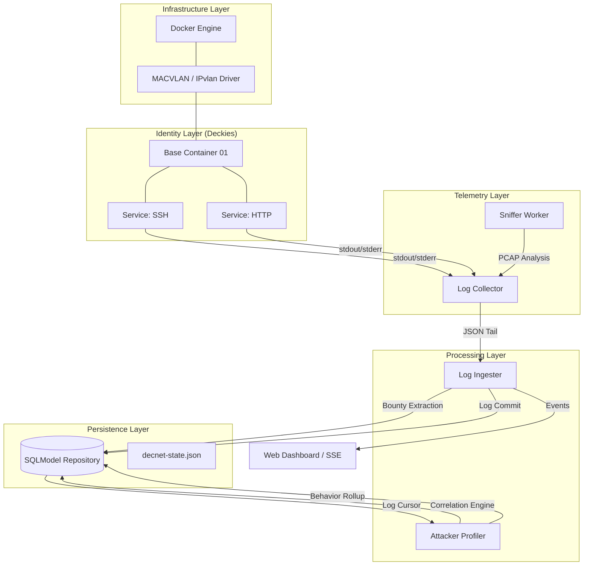

# DECNET Technical Architecture: Deep Dive

This document provides a low-level technical decomposition of the DECNET (Deception Network) framework. It covers the internal orchestration logic, networking internals, reactive data pipelines, and the persistent intelligence schema.

---

## 1. System Topology & Micro-Services

DECNET is architected as a set of decoupled "engines" that interact via a persistent shared repository (SQLite/MySQL) and the Docker socket.

### Component Connectivity Graph

---

## 2. Core Orchestration: The "Decky" Lifecycle

A **Decky** is a logical entity represented by a shared network namespace.

### The Deployment Flow (`decnet deploy`)
1.  **Configuration Parsing**: `DecnetConfig` (via `ini_loader.py`) validates the archetypes and service counts.
2.  **IP Allocation**: `ips_to_range()` calculates the minimal CIDR covering all requested IPs to prevent exhaustion of the host's subnet.
3.  **Network Setup**:
    - Calls `docker network create -d macvlan --parent eth0`.
    - Creates a host-side bridge (`decnet_macvlan0`) to fix the Linux bridge isolation issue (hairpin fix).
4.  **Logging Injection**: Every service container has `decnet_logging.py` injected into its build context to ensure uniform RFC 5424 syslog output.
5.  **Compose Generation**: `write_compose()` creates a dynamic `docker-compose.yml` where:
    - Service containers use `network_mode: "service:<base_container_name>"`.
    - Base containers use `sysctls` derived from `os_fingerprint.py`.

### Teardown & State
Runtime state is persisted in `decnet-state.json`. Upon `teardown`, DECNET:
1.  Runs `docker compose down`.
2.  Deletes the host-side macvlan interface and routes.
3.  Removes the Docker network.
4.  Clears the CLI state.

---

## 3. Networking Internals: Passive & Active Fidelity

### OS Fingerprinting (TCP/IP Spoofing)
DECNET tunes the networking behavior of each Decky within its own namespace. This is handled by the `os_fingerprint.py` module, which sets specific `sysctls` in the base container:
- `net.ipv4.tcp_window_scaling`: Enables/disables based on OS profile.
- `net.ipv4.tcp_timestamps`: Mimics specific OS tendencies (e.g., Windows vs. Linux).
- `net.ipv4.tcp_syncookies`: Prevents OS detection via SYN-flood response patterns.

### The Packet Flow
1.  **Ingress**: Packet hits physical NIC -> MACVLAN Bridge -> Target Decky Namespace.
2.  **Telemetry**: The `Sniffer` container attaches to the same MACVLAN bridge in promiscuous mode. It uses scapy-like logic (via `decnet.sniffer`) to extract:
    - **JA3/JA4**: TLS ClientHello fingerprints.
    - **HASSH**: SSH Key Exchange fingerprints.
    - **JARM**: (Triggered actively) TLS server fingerprints.

---

## 4. Persistent Intelligence: Database Schema

DECNET uses an asynchronous SQLModel-based repository. The schema is optimized for both high-speed ingestion and complex behavioral correlation.

### Entity Relationship Model

| Table | Purpose | Key Fields |
| :--- | :--- | :--- |
| **logs** | Raw event stream | `id`, `timestamp`, `decky`, `service`, `event_type`, `attacker_ip`, `fields` |
| **bounty** | Harvested artifacts | `id`, `bounty_type`, `payload` (JSON), `attacker_ip` |
| **attackers** | Aggregated profiles | `uuid`, `ip`, `is_traversal`, `traversal_path`, `fingerprints` (JSON), `commands` (JSON) |
| **attacker_behavior** | behavioral profile | `attacker_uuid`, `os_guess`, `behavior_class`, `tool_guesses` (JSON), `timing_stats` (JSON) |

### JSON Logic
To maintain portability across SQLite/MySQL, DECNET uses the `JSON_EXTRACT` function for filtering logs by internal fields (e.g., searching for a specific HTTP User-Agent inside the `fields` column).

---

## 5. Reactive Processing: The Internal Pipeline

### Log Ingestion & Bounty Extraction
1.  **Tailer**: `log_ingestion_worker` tails the JSON log stream.
2.  **.JSON Parsing**: Every line is validated against the RFC 5424 mapping.
3.  **Extraction Logic**:
    - If `event_type == "credential"`, a row is added to the `bounty` table.
    - If `ja3` field exists, a `fingerprint` bounty is created.
4.  **Notification**: Logs are dispatched to active WebSocket/SSE clients for real-time visualization.

### Correlation & Traversal Logic
The `CorrelationEngine` processes logs in batches:
- **IP Grouping**: Logs are indexed by `attacker_ip`.
- **Hop Extraction**: The engine identifies distinct `deckies` touched by the same IP.
- **Path Calculation**: A chronological string (`decky-A -> decky-B`) is built to visualize the attack progression.
- **Attacker Profile Upsert**: The `Attacker` table is updated with the new counts, path, and consolidated bounty history.

---

## 6. Service Plugin Architecture

Adding a new honeypot service is zero-configuration. The `decnet/services/registry.py` uses `pkgutil.iter_modules` to auto-discover any file in the `services/` directory.

### `BaseService` Interface
Every service must implement:
- `name`: Unique identifier (e.g., "ssh").
- `ports`: Targeted ports (e.g., `22/tcp`).
- `dockerfile_context()`: Path to the template directory.
- `compose_service(name, base_name)`: Returns the Docker Compose fragment.

### Templates
Templates (found in `/templates/`) contain the Dockerfile and entrypoint. The `deployer` automatically syncs `decnet_logging.py` into these contexts during build time to ensure logs are streamed correctly to the host.
