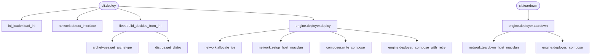
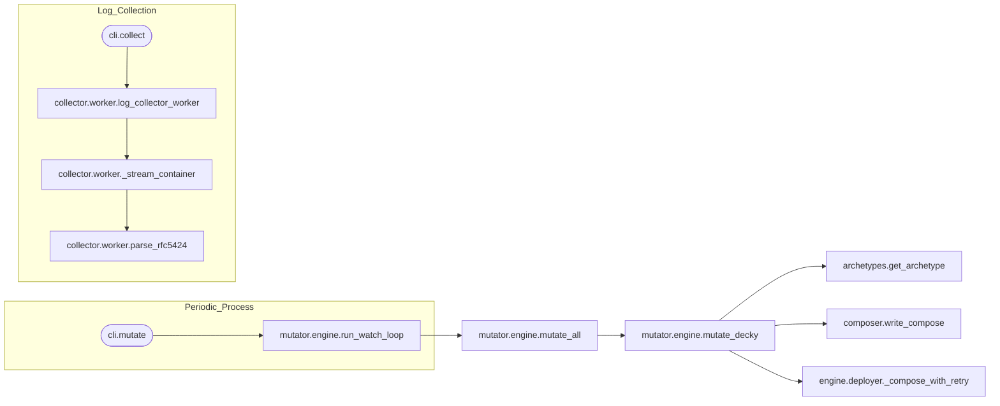
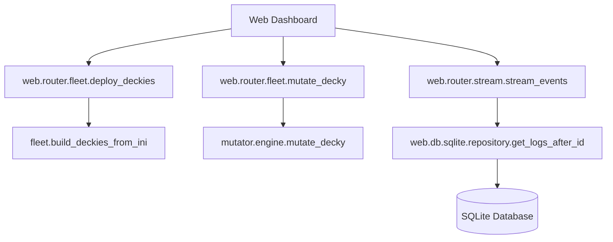

# DECNET Execution Graphs

These graphs illustrate the logical flow of execution within the DECNET framework, showing how high-level commands and API requests trigger secondary processes and subsystem interactions.

## 1. Deployment & Teardown Flow
This flow shows the orchestration from a CLI `deploy` command down to network setup and container instantiation.

## 2. Mutation & Monitoring Flow
How DECNET maintains deception by periodically changing decoy identities and monitoring activities.

## 3. Web API Flow (Fleet Management)
How the Web UI interacts with the underlying systems via the FastAPI router.

